# Blast Architecture Diagrams

## System Architecture

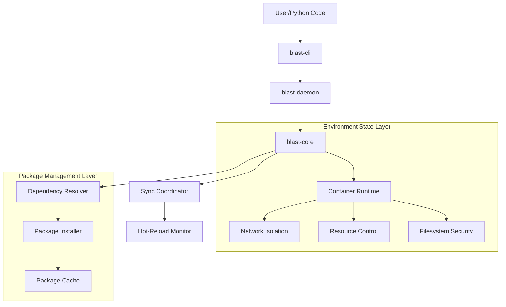

## Sandboxing Layers

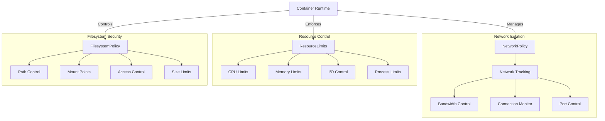

## State Management

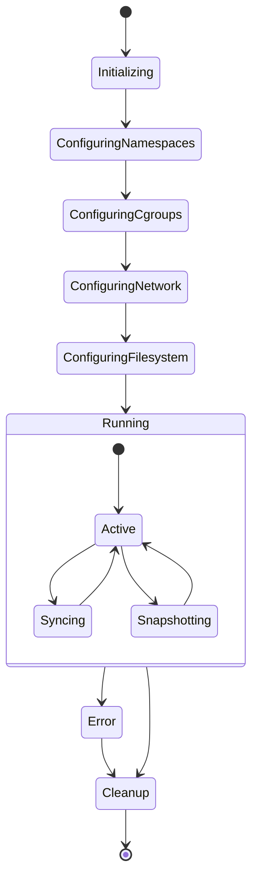

## Component Interaction

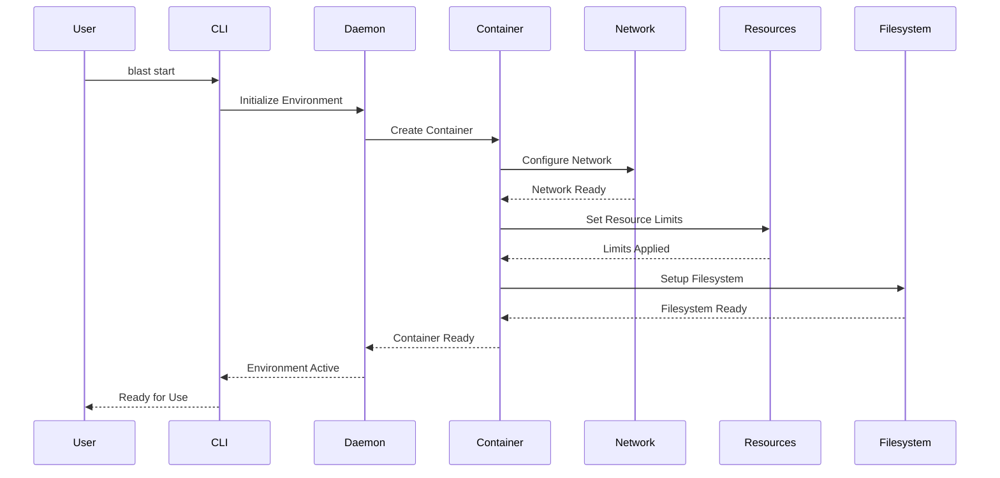

## Security Policy Flow

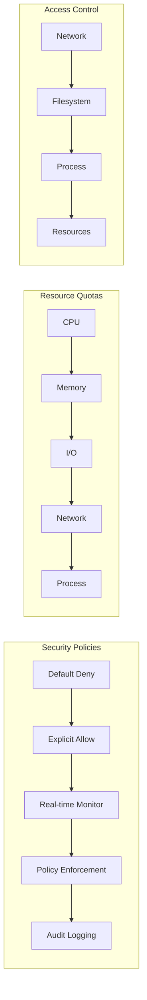

## Package Management Flow

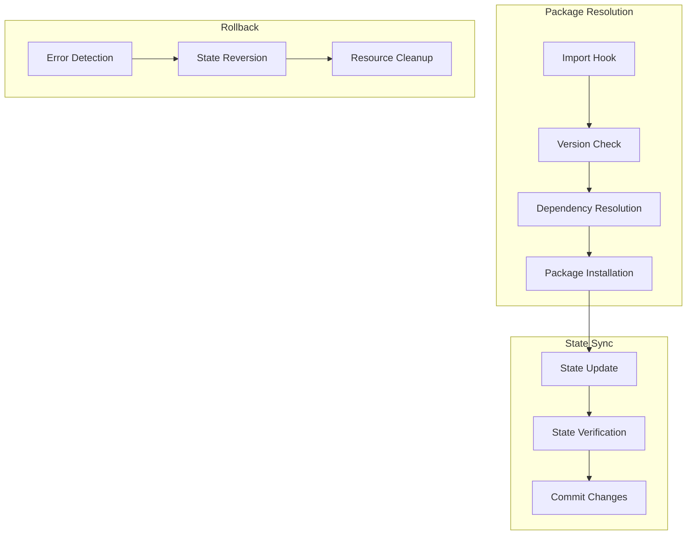

## Environment Lifecycle

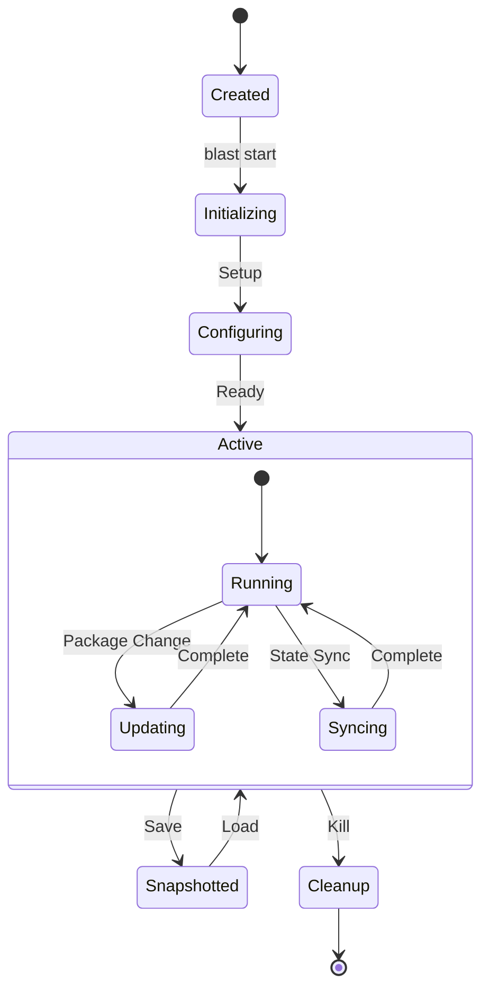

## Network Isolation Model

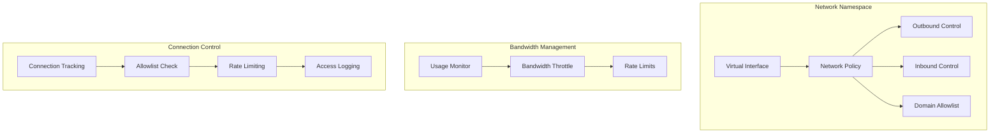

## Resource Control Model

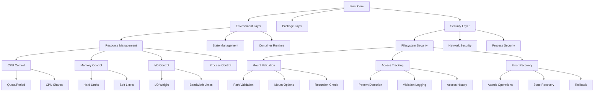

## Filesystem Security Model

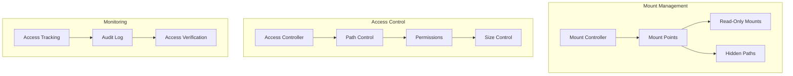

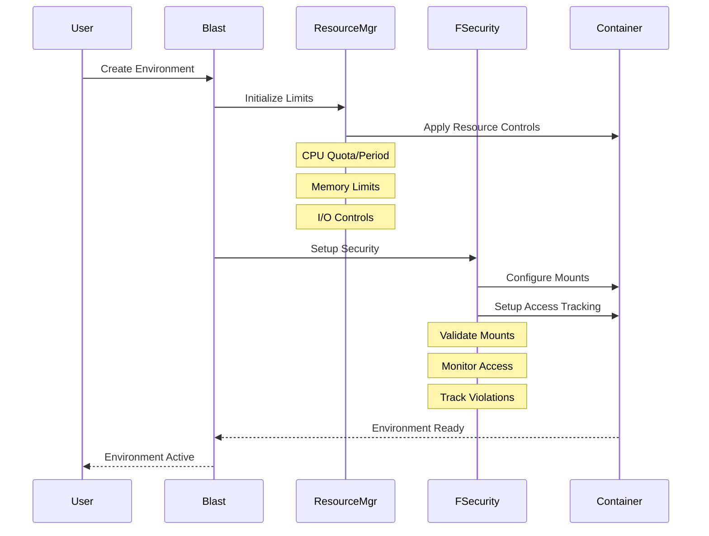