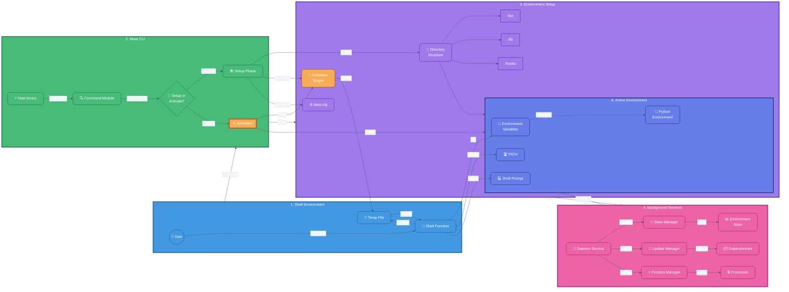

# Blast System Architecture

## Flow Description

1. **Shell Environment** 🔄
   - User invokes `blast start`
   - Shell function intercepts command
   - Creates temporary file for activation

2. **Blast CLI** ⚡
   - Binary processes command
   - Determines if setup or activation needed
   - Routes to appropriate handler

3. **Environment Setup** 🏗️
   - Creates directory structure
   - Generates activation scripts
   - Sets up configuration
   - Prepares Python environment

4. **Background Services** 👾
   - Daemon manages state
   - Handles dependency updates
   - Controls process isolation
   - Maintains environment state

5. **Activation** 🔌
   - Reads activation script
   - Outputs to temp file
   - Shell sources the script

6. **Active Environment** 💻
   - Sets environment variables
   - Updates PATH
   - Modifies shell prompt
   - Configures Python environment

The system follows a clear left-to-right flow, with each component building on the previous one. The daemon service runs continuously in the background, while the activation process is a one-time operation that sets up the shell environment.

---
*Note: Colors are based on the Tailwind CSS color palette for professional, modern aesthetics. Emojis are used to enhance visual understanding of each component's function.* 
